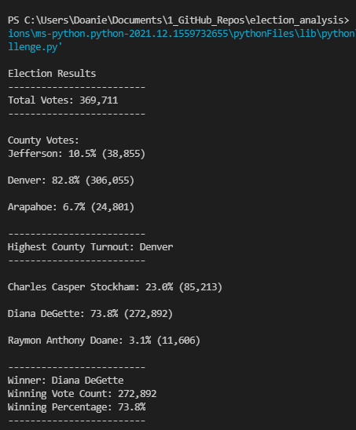
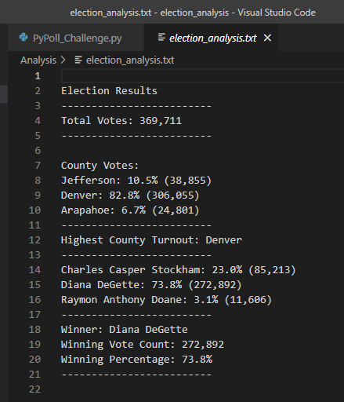

# Election_Analysis

## Overview Of Election Audit: 
The purpose of this analysis was to audit a **local Congressional election** for a **Colorado Board of Elections**.  

A Colorado Board of Elections employee outlined the following tasks for the election audit: 

1. Calculate the **total number of votes** cast in the election. 
2. Get a **complete list of candidates** who received votes. 
3. Calculate the total number of **votes each candidate received**. 
4. Calculate the **percentage of votes each candidate won.** 
5. Determine the **winner of the election** based on the popular vote. 

## Resources
- Data Source: election_results.csv
- Software: Python - Version 3.7.6
- Software: Visual Studio Code - Version 1.63.2
- OS: Windows_NT x64 10.0.19042

## Election Audit Results
This election audit analysis revealed the following outcomes: 
- There were **369,711 total votes** cast in this Congressional election.
- **County Summary - Number of Votes & Percentage of Total Votes in Election Precinct:** 
  - The county with the **highest voter turnout** was **Denver County** with **306,055 votes** constituting **82.8%** of total votes.
  - Jefferson County had 38,855 votes equating to 10.5% of total votes.
  - Arapahoe County had 24, 801 votes equating to 6.7% of total votes. 
- **Candidate Summary - Number of Votes & Percentage of Total Votes in Election Precinct:** 
  - Candidate 1, **Charles Casper Stockham**, received 23.0% of the vote with 85,213 votes.  
  - Candidate 2, **Diana DeGette**, received 73.8% of the vote with 272,892 votes.
  - Candidate 3, **Raymon Anthony Doane**, received 3.1% of the vote with 11,606 votes.
- **Winning Candidate Summary:**
  - Candidate 2, **Diana DeGette**, won the election by receiving **73.8%** of the vote with **272,892 votes.** 
   


***Election Audit Results Printed to the Command Line:***




***Election Audit Results Saved to a Text File:***




## Election Audit Summary
Analysis of election results is an important component of election oversight. Timely and accurate election audits are necessary to build public confidence in democratic processes and support the legitimacy of elected officials. This proposal outlines a plan in which this election analysis code can be re-purposed to conduct future election audits in support of these efforts.

Some examples of code modification to facilitate future election audits include: 
- The **file_to_load** .csv path to the data set will need to be updated in order to analyze the applicable election results data set. 
- The **file_to_save** .txt path for writing the results will need to be updated. 
```
# Add a variable to load a file from a path.
file_to_load = os.path.join("Resources", "election_results.csv")
# Add a variable to save the file to a path.
file_to_save = os.path.join("analysis", "election_analysis.txt")
```
- It will be important to ensure that the data set .csv file has the same headers/columns as election_results.csv to ensure that the code can run smoothly. 
- Alternatively, the **column indexes** would need to be updated to match the new data set if the headers/columns differ. 
- See the **candidate_name** & **county_name variables** in the code block below where the **column indexes** would need to be updated **within the [ ]**:
```
# For each row in the CSV file.
    for row in reader:

        # Add to the total vote count
        total_votes = total_votes + 1

        # Get the candidate name from each row.
        candidate_name = row[2]

        # 3: Extract the county name from each row.
        # Get the county name from each row using index aka 2nd column, Index 1
        county_name = row[1]  
 ```

